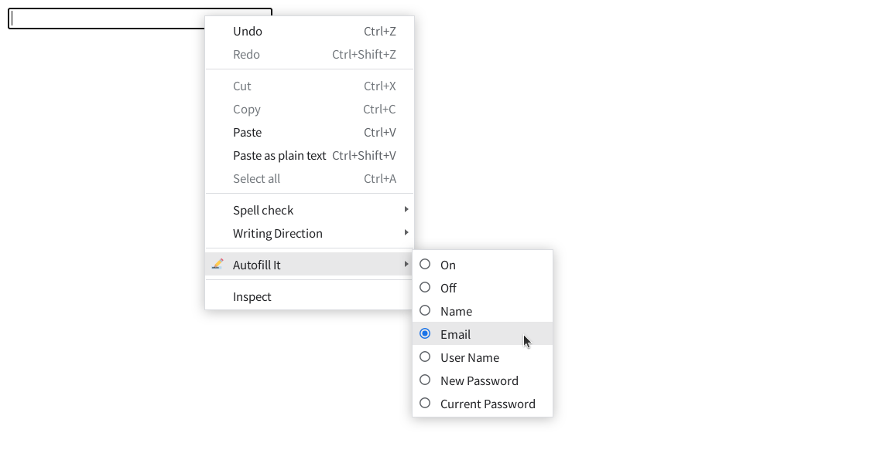

<div align="center">

#  Autofill It

Enable browser autofill for any input field.

**Get it on Chrome Web Store!**

[](https://chrome.google.com/webstore/detail/autofill-it/gfkfgjldpbbejklbagcclbcfpfkmknle)

</div>

[](https://github.com/ygkn/autofill-it/actions/workflows/code-check.yml)

A Google Chrome extension that sets `autocomplete` attributes of any editable (`<input />`, `<textarea />`, etc...) input fields.



## 🚀 Development

### Requirements

- Node.js
- pnpm

### Installation

```sh
pnpm install # Install dependencies
```

### Run

```sh
pnpm dev # Build with watch mode
pnpm build # Build without watch mode
```

See [package.json](package.json) for more details.
